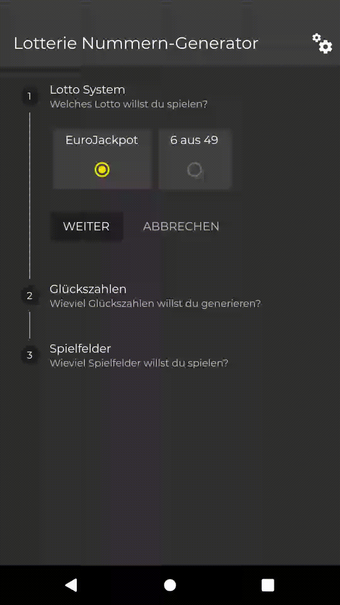

# The Lottery Number Generator

## apk
apk release build can be found in folder <code>./apk/app-release.apk</code>

### Support Lottery Systems
- EuroJackpot
- 6 aus 49 (Germany)

### Supported Languages
- German
- English
- Dutch
- Spanish
- Italian

### Supported Themes
- Dark
- Bright

## What it does 
A flutter application to generate random lottery numbers

This app helpd you to generate winning numbers and distribute these numbers onto the desired amount of fields / squares.

## What Dart packages the App uses
- provider
- shared_preferences
- day_night_switch
- flutter_icons
